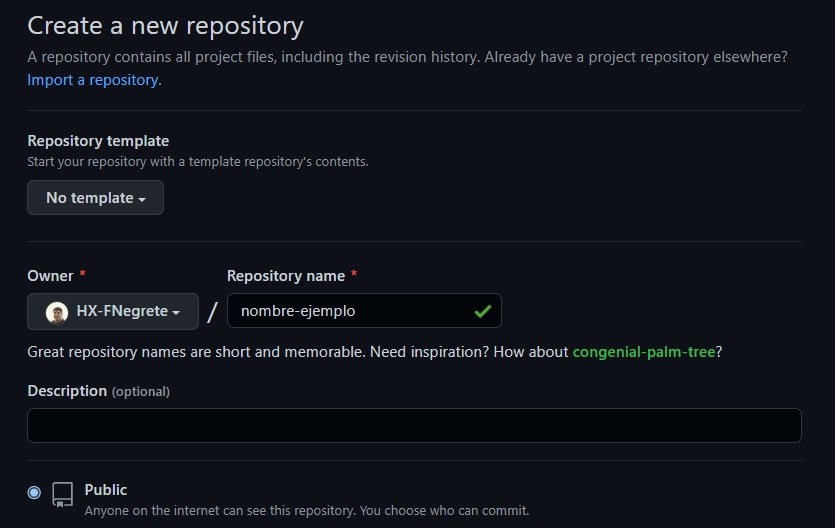
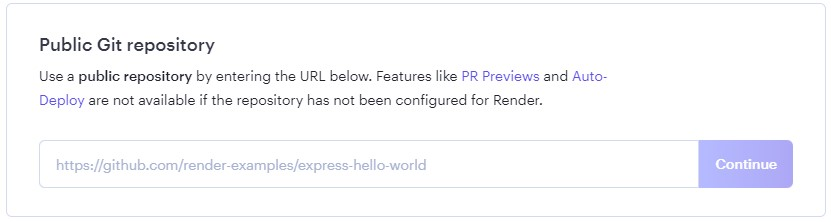
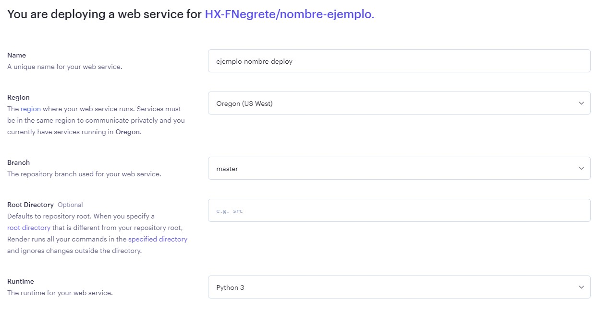
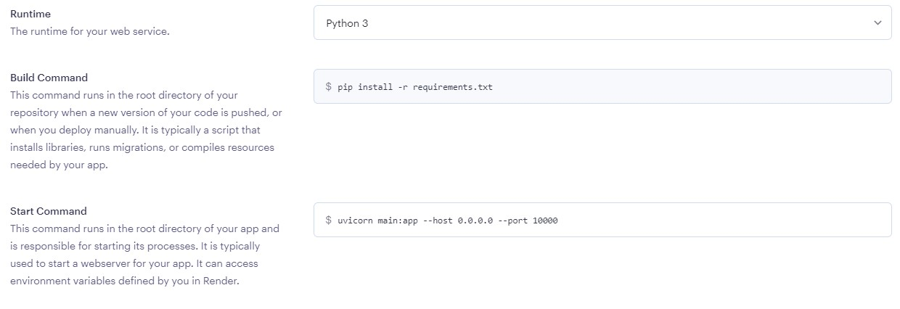
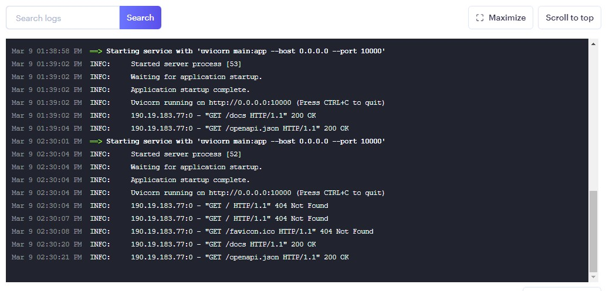
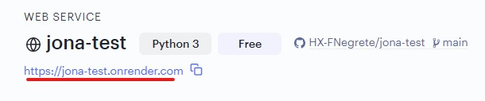

# Tutorial Render + FastAPI


## Crear entorno virtual
Todas las dependencias y librerías van a quedar instaladas acá:
```
python -m venv venv
```
## Crear archivos necesarios
Desde la consola Gitbash:
```
touch .gitignore
touch main.py
touch requirements.txt
```
## venv + .gitignore
Poner el entorno virtual dentro del archivo .gitignore:
```
/venv
```
Si no funciona, probar de distintas formas:
```
/venv
venv
venv/
```
## Git init + Instalaciones
Desde la misma terminal de VSCode, realizar los siguientes pasos:
```
git init
pip install uvicorn
pip install fastapi
```
Cualquier otra librería que se vaya a utilizar también puede ser descargada en este momento, o cuando sea necesario.

## Pip freeze
Una vez que ya están todas las librerías descargadas en nuestro entorno virtual, podemos hacer el freeze de los requirements.  
 Es importante para este tutorial no abusar de demasiadas dependencias, porque en algunos casos, luego las aplicaciones no pueden deployar nuestros modelos. 
```
pip freeze > requirements.txt
```
Si luego se necesita instalar otra librería más, se vuelve a ejecutar este comando.  

Cualquier persona que quiera usar nuestro código, va a poder instalar lo mismo que instalamos nosotros. 
## main.py
Ahora ya esta listo para poder codear toda tu API con Fastapi.
## Creación repo Github
- Crear un nuevo repo en Github. Dejarlo en modo público.

- Seguir los pasos para conectarlo con nuestro repositorio local

## Render
1. Entrar en `render.com` y crearse una nueva cuenta de usuario. 
2. Elegir la opción `Web Service`
3. Ir al apartado que se encuentra abajo de `Public Git repository`. Copiar y pegar el enlace del repositorio que crearon anteriormente (recuerden que sea público).

4. Llenar los campos necesarios. En branch seleccionen `main`. Runtime tiene que ser `Python 3`.

5. El resto de los campos se deben llenar con la misma información que en la imagen:

6. Seleccionar la opción `Create Web Service`
7. Una vez terminados los pasos anteriores, se va a comenzar a cargar nuestra aplicación. Puede tardar unos minutos. 

8. Entrar al enlace de arriba a la izquierda:

9. Nos va a direccionar a nuestra API. Si les aparece un "Not found", no se preocupen, agreguenle un /docs a su enlace.

Con todos esos pasos, la API que crearon ya está lista para poder ser consumida!